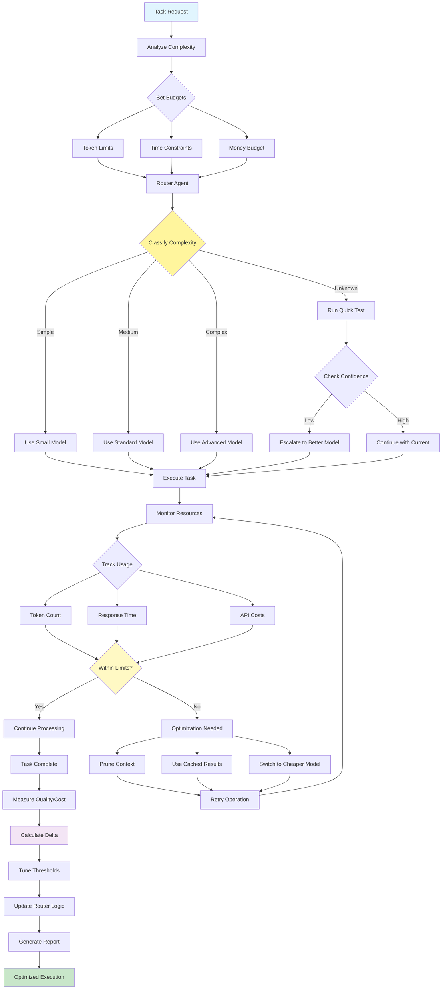

**English** | [繁體中文](zh-TW/16-resource-aware-optimization.md)

# 16. Resource-Aware Optimization Pattern

## When to Use

- **Cost-sensitive operations**: When managing API or compute costs
- **High-volume processing**: Optimizing large-scale operations
- **Variable workloads**: Different tasks need different resources
- **Budget constraints**: Operating within financial limits
- **Performance requirements**: Balancing speed vs cost
- **Multi-tenant systems**: Fair resource allocation across users

## Visual Flow

## Where It Fits

- **SaaS platforms**: Managing per-customer resource usage
- **Batch processing**: Optimizing large data processing jobs
- **Real-time systems**: Balancing latency and cost
- **Development environments**: Using cheaper models for testing
- **Production systems**: Optimizing operational costs

## Pros

- **Cost reduction**: Significant savings on API and compute costs
- **Performance optimization**: Right-sized resources for each task
- **Scalability**: Efficient resource use enables growth
- **Flexibility**: Dynamic adjustment to workload changes
- **Budget control**: Predictable operational costs
- **Quality preservation**: Maintains output quality where needed
- **Automatic optimization**: Self-tuning based on patterns

## Cons

- **Complexity increase**: Resource management adds overhead
- **Quality variations**: Different models produce different results
- **Routing overhead**: Classification step adds latency
- **Monitoring requirements**: Need comprehensive tracking
- **Tuning challenges**: Finding optimal thresholds takes time
- **Cache management**: Maintaining cache coherency
- **User experience**: Inconsistent response times

## Real-World Examples

1. **Customer Support Platform**:
   - Simple FAQs use lightweight models
   - Complex issues use advanced models
   - Cache common question responses
   - Prioritize premium customers
   - Track cost per ticket resolution

2. **Content Generation Service**:
   - Short social posts use fast models
   - Long articles use quality models
   - Reuse templates for common requests
   - Batch similar requests together
   - Monitor cost per content piece

3. **Code Assistant Tool**:
   - Syntax fixes use simple models
   - Architecture design uses advanced models
   - Cache common code patterns
   - Prioritize based on project importance
   - Track cost per developer action

4. **Translation Platform**:
   - Common languages use basic models
   - Rare languages use specialized models
   - Cache frequent translations
   - Batch document processing
   - Optimize cost per word translated

5. **Data Analysis System**:
   - Simple aggregations use basic compute
   - Complex ML uses premium resources
   - Cache intermediate results
   - Schedule heavy jobs off-peak
   - Monitor cost per analysis

6. **Educational Platform**:
   - Basic Q&A uses lightweight models
   - Complex tutoring uses advanced models
   - Cache common explanations
   - Allocate resources by subscription tier
   - Track cost per student interaction

## Original Files

- **Pattern Discussion**: [pattern-discussion/resource-aware-optimization.md](../pattern-discussion/resource-aware-optimization.md)
- **Mermaid Source**: [mermaid-diagrams/resource-aware-optimization.mmd](../mermaid-diagrams/resource-aware-optimization.mmd)
