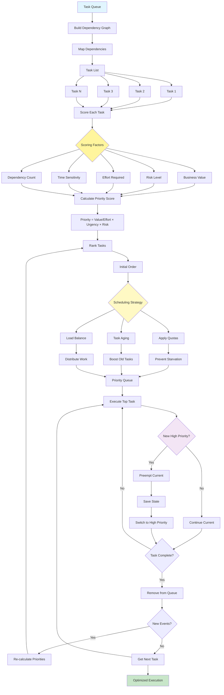

# 20. Prioritization Pattern# 20. Prioritization Pattern


- **Mermaid Source**: [mermaid-diagrams/prioritization.mmd](../mermaid-diagrams/prioritization.mmd)- **Pattern Discussion**: [pattern-discussion/prioritization.md](../pattern-discussion/prioritization.md)## Original Files   - Load balancing   - Emergency traffic priority   - Fair queuing   - Latency-sensitive routing   - Bandwidth allocation   - QoS packet prioritization6. **Network Traffic Management**:   - Cross-platform coordination   - Social media timing   - SEO value scoring   - Author availability   - Editorial calendar   - Trending topic priority5. **Content Publishing**:   - Maintenance windows   - Quality requirements   - Setup time minimization   - Resource optimization   - Deadline management   - Order value prioritization4. **Manufacturing Scheduler**:   - Appointment scheduling   - Test result prioritization   - Specialist routing   - Resource availability   - Wait time consideration   - Emergency severity scoring3. **Healthcare Triage**:   - Resource allocation   - Sprint capacity planning   - Dependency resolution   - Technical debt scheduling   - Feature value scoring   - Critical bugs prioritized2. **Software Development Pipeline**:   - Load balancing across agents   - SLA compliance tracking   - Skill-based routing   - Age-based escalation   - Urgent issues ranked higher   - Premium customers get priority1. **Customer Support System**:## Real-World Examples- **Prediction errors**: Effort estimates may be wrong- **Dependencies**: Complex dependency management- **Subjective scoring**: Priority factors may be disputed- **Context switching**: Preemption adds overhead- **Starvation risk**: Low-priority tasks may wait forever- **Overhead**: Continuous reordering costs resources- **Complexity**: Priority calculation can be complex## Cons- **Scalability**: Handles growing task queues- **Goal alignment**: Tasks ranked by business value- **Transparency**: Clear prioritization logic- **Adaptability**: Adjusts to changing conditions- **Fairness**: Prevents indefinite delays- **Responsiveness**: High-priority items handled first- **Efficiency**: Optimal use of resources## Pros- **DevOps**: Deployment and maintenance prioritization- **Healthcare**: Patient triage systems- **Manufacturing**: Production scheduling- **Customer service**: Ticket prioritization- **Task management systems**: Workflow orchestration## Where It Fits```    style End fill:#c8e6c9    style Monitor fill:#f3e5f5    style Schedule fill:#fff9c4    style Value fill:#fff59d    style Start fill:#e1f5fe    Next --> End[Optimized Execution]        Next --> Execute    Reorder --> Rank        Events -->|No| Next[Get Next Task]    Events -->|Yes| Reorder[Re-calculate Priorities]        Remove --> Events{New Events?}        Complete -->|No| Execute    Complete -->|Yes| Remove[Remove from Queue]        Switch --> Complete    Continue --> Complete{Task Complete?}        Save --> Switch[Switch to High Priority]    Preempt --> Save[Save State]        Monitor -->|No| Continue[Continue Current]    Monitor -->|Yes| Preempt[Preempt Current]        Execute --> Monitor{New High Priority?}        Queue2 --> Execute[Execute Top Task]        Distribute --> Queue2    Boost --> Queue2    Prevent --> Queue2[Priority Queue]        Balance --> Distribute[Distribute Work]    Aging --> Boost[Boost Old Tasks]    Quota --> Prevent[Prevent Starvation]        Schedule --> Balance[Load Balance]    Schedule --> Aging[Task Aging]    Schedule --> Quota[Apply Quotas]        Order --> Schedule{Scheduling Strategy}        Rank --> Order[Initial Order]    Formula --> Rank[Rank Tasks]        Calculate --> Formula[Priority = Value/Effort × Urgency × Risk]        Dependencies --> Calculate    Urgency --> Calculate    Effort --> Calculate    Risk --> Calculate    Business --> Calculate[Calculate Priority Score]        Value --> Dependencies[Dependency Count]    Value --> Urgency[Time Sensitivity]    Value --> Effort[Effort Required]    Value --> Risk[Risk Level]    Value --> Business[Business Value]        Score --> Value{Scoring Factors}        TN --> Score    T3 --> Score    T2 --> Score    T1 --> Score[Score Each Task]        Tasks --> TN[Task N]    Tasks --> T3[Task 3]    Tasks --> T2[Task 2]    Tasks --> T1[Task 1]    Map --> Tasks[Task List]    Build --> Map[Map Dependencies]        Start[Task Queue] --> Build[Build Dependency Graph]graph TD```mermaid## Visual Flow- **Fair scheduling**: Preventing task starvation- **Time-sensitive operations**: Deadline-driven work- **Complex dependencies**: Tasks with interdependencies- **Dynamic environments**: Constantly changing priorities- **Multiple objectives**: Competing goals and tasks- **Resource constraints**: Limited processing capacity## When to Use
## When to Use

- **Resource constraints**: Limited processing capacity
- **Multiple objectives**: Competing goals and tasks
- **Dynamic environments**: Constantly changing priorities
- **Complex dependencies**: Tasks with interdependencies
- **Time-sensitive operations**: Deadline-driven work
- **Fair scheduling**: Preventing task starvation

## Visual Flow



## Where It Fits

- **Task management systems**: Workflow orchestration
- **Customer service**: Ticket prioritization
- **Manufacturing**: Production scheduling
- **Healthcare**: Patient triage systems
- **DevOps**: Deployment and maintenance prioritization

## Pros

- **Efficiency**: Optimal use of resources
- **Responsiveness**: High-priority items handled first
- **Fairness**: Prevents indefinite delays
- **Adaptability**: Adjusts to changing conditions
- **Transparency**: Clear prioritization logic
- **Goal alignment**: Tasks ranked by business value
- **Scalability**: Handles growing task queues

## Cons

- **Complexity**: Priority calculation can be complex
- **Overhead**: Continuous reordering costs resources
- **Starvation risk**: Low-priority tasks may wait forever
- **Context switching**: Preemption adds overhead
- **Subjective scoring**: Priority factors may be disputed
- **Dependencies**: Complex dependency management
- **Prediction errors**: Effort estimates may be wrong

## Real-World Examples

1. **Customer Support System**:
   - Premium customers get priority
   - Urgent issues ranked higher
   - Age-based escalation
   - Skill-based routing
   - SLA compliance tracking
   - Load balancing across agents

2. **Software Development Pipeline**:
   - Critical bugs prioritized
   - Feature value scoring
   - Technical debt scheduling
   - Dependency resolution
   - Sprint capacity planning
   - Resource allocation

3. **Healthcare Triage**:
   - Emergency severity scoring
   - Wait time consideration
   - Resource availability
   - Specialist routing
   - Test result prioritization
   - Appointment scheduling

4. **Manufacturing Scheduler**:
   - Order value prioritization
   - Deadline management
   - Resource optimization
   - Setup time minimization
   - Quality requirements
   - Maintenance windows

5. **Content Publishing**:
   - Trending topic priority
   - Editorial calendar
   - Author availability
   - SEO value scoring
   - Social media timing
   - Cross-platform coordination

6. **Network Traffic Management**:
   - QoS packet prioritization
   - Bandwidth allocation
   - Latency-sensitive routing
   - Fair queuing
   - Emergency traffic priority
   - Load balancing

## Original Files

- **Pattern Discussion**: [pattern-discussion/prioritization.md](../pattern-discussion/prioritization.md)
- **Mermaid Source**: [mermaid-diagrams/prioritization.mmd](../mermaid-diagrams/prioritization.mmd)
