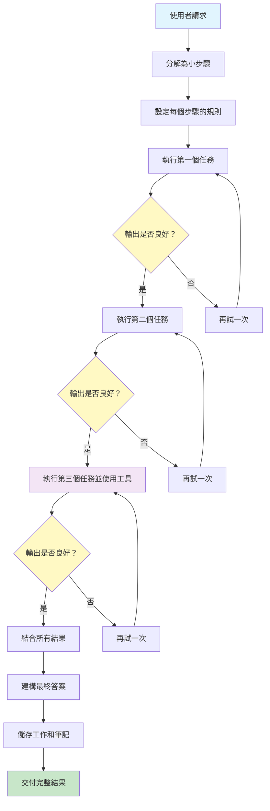

[English](../01-prompt-chaining.md) | **繁體中文**

# 01. 提示詞鏈接模式 (Prompt Chaining Pattern)

## 何時使用

- **複雜的多步驟流程**：當您需要將複雜任務分解為離散的、可管理的步驟時
- **資料轉換管線**：當資訊需要通過具有不同需求的多個階段進行處理時
- **品質關鍵工作流程**：當每個步驟的輸出在繼續之前必須符合特定標準時
- **除錯需求**：當您需要清楚了解每個處理階段時
- **混合工具/AI 操作**：當結合 LLM 呼叫與 API 呼叫、資料庫查詢或其他工具時

## 視覺化流程

## 適用位置

- **文件處理管線**：研究 → 分析 → 寫作 → 編輯 → 出版
- **資料 ETL 工作流程**：提取 → 轉換 → 驗證 → 載入
- **客戶服務流程**：意圖識別 → 資訊收集 → 解決方案生成 → 回應格式化
- **程式碼生成**：需求 → 設計 → 實作 → 測試 → 文件
- **內容創作**：構思 → 大綱 → 草稿 → 審查 → 完成

## 優點

- **模組化**：每個步驟可以獨立開發、測試和最佳化
- **可除錯性**：清楚了解鏈中何處發生故障
- **可靠性**：結構化資料契約確保步驟之間的一致交接
- **可重用性**：個別鏈組件可在不同工作流程中重用
- **錯誤處理**：每個步驟可以有特定的重試邏輯和後備策略
- **漸進式進展**：如果中斷，可以儲存和恢復部分結果
- **平行開發**：不同團隊成員可以處理不同的鏈段

## 缺點

- **延遲累積**：每個步驟都會增加處理時間，導致總執行時間更長
- **上下文限制**：資訊可能在步驟之間遺失或壓縮
- **錯誤傳播**：鏈早期的錯誤可能在後續步驟中級聯
- **複雜度開銷**：簡單任務可能因不必要的步驟而過度工程化
- **成本倍增**：每次 LLM 呼叫都會產生成本，在鏈中累積
- **剛性結構**：對於需要動態適應的任務可能缺乏彈性
- **狀態管理**：需要仔細處理中間結果和上下文

## 實際案例

1. **法律文件分析**：
   - 步驟 1：從合約中提取關鍵條款
   - 步驟 2：識別潛在風險和義務
   - 步驟 3：與標準模板比較
   - 步驟 4：生成包含建議的執行摘要

2. **電子商務產品描述**：
   - 步驟 1：從製造商資料中提取產品特徵
   - 步驟 2：研究競爭對手的描述和定價
   - 步驟 3：生成 SEO 最佳化描述
   - 步驟 4：為不同平台創建變體
   - 步驟 5：根據品牌指南驗證

3. **學術研究助理**：
   - 步驟 1：解析研究問題並識別關鍵概念
   - 步驟 2：搜尋和檢索相關論文
   - 步驟 3：提取和總結研究發現
   - 步驟 4：識別差距和矛盾
   - 步驟 5：生成帶引用的文獻回顧

4. **軟體錯誤分析**：
   - 步驟 1：解析錯誤日誌和堆疊追蹤
   - 步驟 2：識別受影響的組件
   - 步驟 3：在知識庫中搜尋類似問題
   - 步驟 4：生成潛在解決方案
   - 步驟 5：創建包含重現步驟的詳細錯誤報告

5. **財務報告生成**：
   - 步驟 1：從多個來源收集資料
   - 步驟 2：執行計算和分析
   - 步驟 3：識別趨勢和異常
   - 步驟 4：生成敘述性解釋
   - 步驟 5：格式化為符合法規的報告

## 原始檔案

- **模式討論**：[pattern-discussion/prompt-chaining.md](../../pattern-discussion/prompt-chaining.md)
- **Mermaid 來源**：[mermaid-diagrams/prompt-chaining.mmd](../../mermaid-diagrams/prompt-chaining.mmd)
