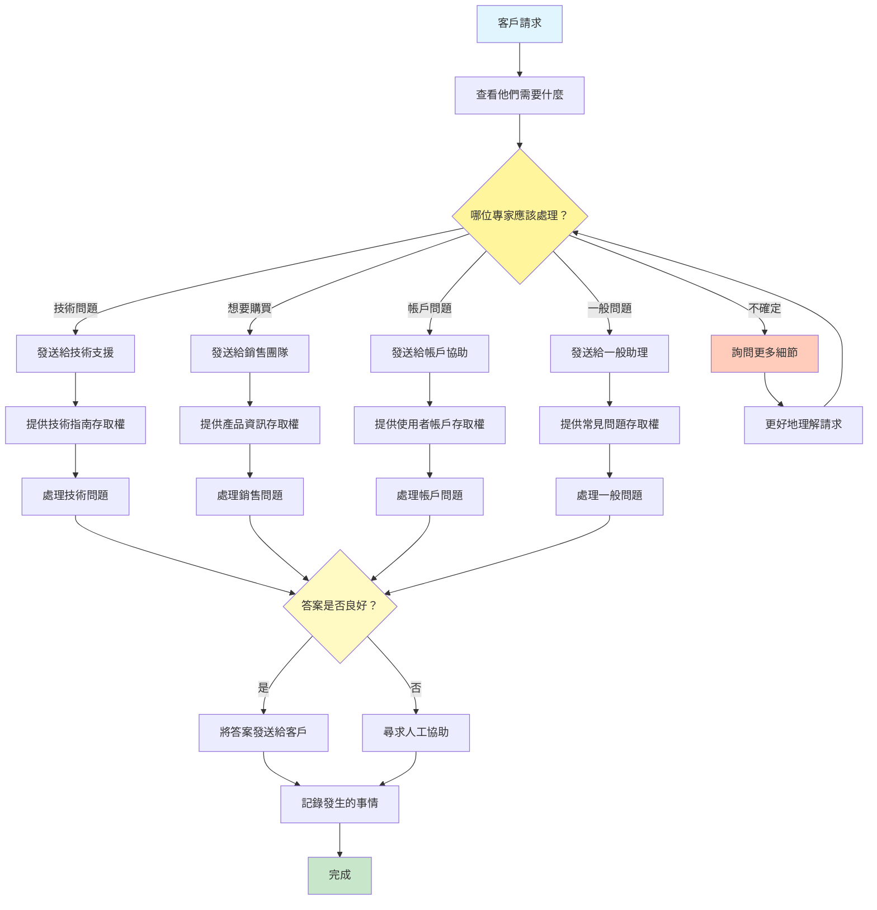

[English](../02-routing.md) | **繁體中文**

# 02. 路由模式 (Routing Pattern)

## 何時使用

- **多領域系統**：當處理需要不同專業知識的多樣化請求類型時
- **動態工作流程選擇**：當適當的流程取決於輸入特性時
- **資源最佳化**：當不同請求需要不同的計算資源時
- **專業化工具存取**：當需要根據請求類型使用特定工具或 API 時
- **基於信心的處理**：當需要以不同方式處理模糊請求時
- **負載平衡**：當在多個專業代理之間分配工作時

## 視覺化流程

## 適用位置

- **客戶服務平台**：將詢問路由到適當的部門代理
- **多模態 AI 系統**：將請求導向文字、圖像或程式碼處理管線
- **企業自動化**：將任務路由到適當的業務流程工作流程
- **內容審核**：將內容導向適當的審查管線
- **醫療分流**：將患者查詢路由到適當的醫療專家

## 優點

- **專業化**：每個路由可以針對特定任務類型進行最佳化
- **可擴展性**：容易添加新路由而不影響現有路由
- **效率**：請求由最適當的資源處理
- **彈性**：基於上下文和信心的動態路由
- **清晰度**：不同工作流程之間清楚分離關注點
- **效能**：避免對簡單請求進行不必要的處理
- **可維護性**：每個路由可以獨立更新

## 缺點

- **路由器複雜性**：路由邏輯本身可能成為瓶頸
- **誤路由風險**：不正確的路由決策可能導致不良結果
- **延遲開銷**：路由決策的額外步驟增加延遲
- **訓練需求**：路由器需要基於回饋持續改進
- **邊緣案例**：模糊請求可能無法清楚地歸入類別
- **協調開銷**：管理多個專業代理增加複雜性
- **監控複雜性**：需要追蹤多個路徑的效能

## 實際案例

1. **AI 客戶服務中心**：
   - 技術問題 → 具有文件存取權的技術支援代理
   - 帳單問題 → 具有支付系統存取權的財務代理
   - 產品詢問 → 具有目錄存取權的銷售代理
   - 投訴 → 具有 CRM 整合的升級代理
   - 一般問題 → 具有知識庫的常見問題代理

2. **內容創作平台**：
   - 部落格文章 → 長篇寫作代理
   - 社群媒體 → 短篇內容代理
   - 技術文件 → 技術寫作代理
   - 行銷文案 → 文案寫作代理
   - 翻譯 → 在地化代理

3. **程式碼助理路由器**：
   - 錯誤修復 → 具有錯誤分析工具的除錯代理
   - 新功能 → 具有設計模式的開發代理
   - 重構 → 具有最佳實踐的程式碼品質代理
   - 測試 → 具有覆蓋率工具的測試生成代理
   - 文件 → 具有模板庫的文件代理

4. **金融服務路由器**：
   - 交易請求 → 具有市場資料的交易代理
   - 風險評估 → 具有模型的風險分析代理
   - 合規檢查 → 具有法規的合規代理
   - 報告 → 具有模板的報告生成代理
   - 欺詐檢測 → 具有模式檢測的安全代理

5. **教育平台路由器**：
   - 數學問題 → 數學推理代理
   - 語言學習 → 語言導師代理
   - 科學問題 → 科學專家代理
   - 歷史查詢 → 歷史研究代理
   - 學習規劃 → 學習策略代理

## 原始檔案

- **模式討論**：[pattern-discussion/routing.md](../../pattern-discussion/routing.md)
- **Mermaid 來源**：[mermaid-diagrams/routing.mmd](../../mermaid-diagrams/routing.mmd)
