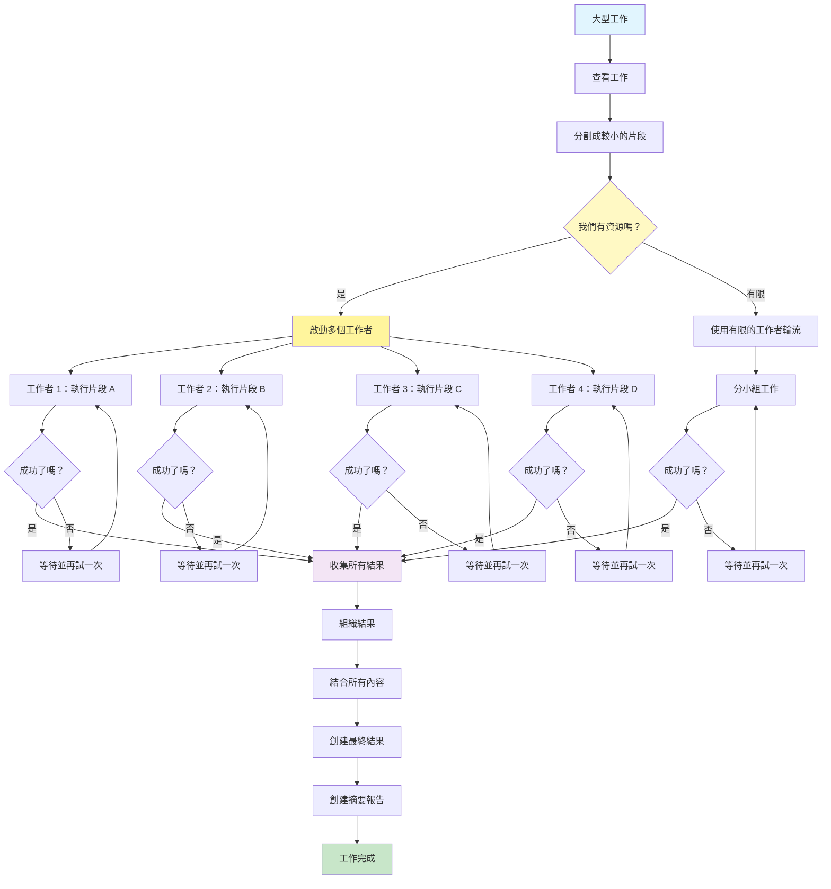

[English](../03-parallelization.md) | **繁體中文**

# 03. 平行化模式 (Parallelization Pattern)

## 何時使用

- **大規模資料處理**：當處理多個文件、記錄或資料來源時
- **時間敏感操作**：當需要快速獲得結果且任務獨立時
- **批次操作**：當對多個項目執行相同操作時
- **網頁抓取/爬取**：當同時從多個來源收集資料時
- **多文件分析**：當獨立分析多個檔案或文件時
- **API 聚合**：當呼叫不相互依賴的多個 API 時

## 視覺化流程

## 適用位置

- **文件處理管線**：同時分析多個 PDF 或報告
- **資料擴充工作流程**：從多個資料來源擴充記錄
- **內容生成**：平行創建多個變體或翻譯
- **研究自動化**：同時搜尋多個資料庫或來源
- **測試框架**：同時執行多個測試情境

## 優點

- **速度提升**：總處理時間顯著減少
- **資源利用**：更好地使用可用的計算資源
- **可擴展性**：根據工作負載輕鬆擴展或縮減
- **故障隔離**：一個工作者的故障不影響其他工作者
- **進度追蹤**：當工作者完成時可以顯示漸進式進度
- **彈性**：可以根據負載動態調整工作者數量
- **成本效益**：最佳化資源使用並減少閒置時間

## 缺點

- **複雜度增加**：管理多個並發流程具有挑戰性
- **資源限制**：API 速率限制和配額限制平行化
- **協調開銷**：同步和結果合併增加複雜性
- **除錯困難**：更難追蹤平行執行中的問題
- **成本倍增**：多個同時的 API 呼叫增加成本
- **記憶體使用**：在記憶體中保存多個結果可能消耗大量資源
- **順序挑戰**：在需要時維護順序需要額外的邏輯

## 實際案例

1. **新聞聚合服務**：
   - 同時從 50 多個新聞來源擷取文章
   - 每個工作者處理一個新聞來源
   - 速率限制為 10 個並發 API 呼叫
   - 合併和去重結果
   - 按相關性和時間戳排序

2. **電子商務價格監控**：
   - 監控 100 多個競爭對手網站的價格
   - 平行工作者抓取產品頁面
   - 處理失敗請求的重試邏輯
   - 將定價資料聚合到比較矩陣中
   - 生成價格變動警報

3. **文件智能系統**：
   - 處理 1000 多頁的法律文件集
   - 分割成 50 頁區塊進行平行分析
   - 每個工作者提取實體和條款
   - 將發現合併到綜合報告中
   - 追蹤每個發現的文件來源

4. **社群媒體分析**：
   - 分析 Twitter、LinkedIn、Facebook、Instagram 上的提及
   - 每個平台的平行工作者
   - 對每個提及應用情感分析
   - 聚合到統一儀表板
   - 生成帶有平台細分的趨勢報告

5. **程式碼儲存庫分析**：
   - 掃描整個程式碼庫以尋找安全漏洞
   - 平行工作者分析不同的目錄
   - 每個工作者執行不同的安全檢查
   - 收集並優先處理所有發現
   - 生成綜合安全報告

6. **多語言翻譯專案**：
   - 將文件翻譯成 15 種語言
   - 每個語言對的平行工作者
   - 使用翻譯記憶體保持一致性
   - 品質檢查每個翻譯
   - 編譯成多語言文件集

## 原始檔案

- **模式討論**：[pattern-discussion/parallelization.md](../../pattern-discussion/parallelization.md)
- **Mermaid 來源**：[mermaid-diagrams/parallelization.mmd](../../mermaid-diagrams/parallelization.mmd)
