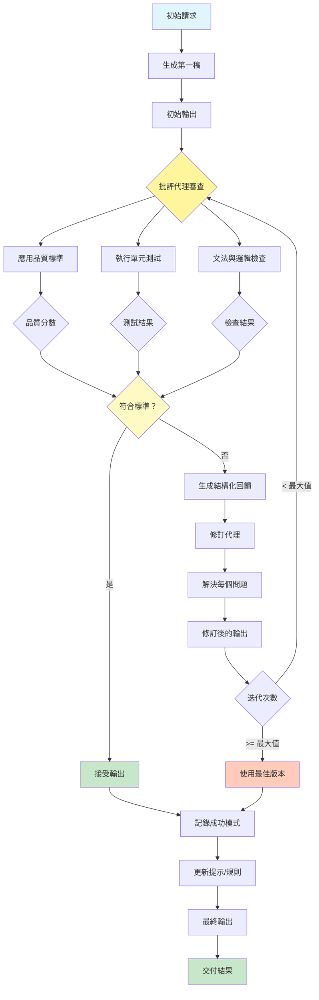

[English](../04-reflection.md) | **繁體中文**

# 04. 反思模式 (Reflection Pattern)

## 何時使用

- **品質關鍵輸出**：當高準確性和品質不可妥協時
- **複雜推理任務**：當問題需要迭代精煉時
- **創意工作**：當內容需要多輪改進時
- **學習系統**：當您希望隨時間提高效能時
- **容易出錯的領域**：當初次嘗試經常有錯誤時
- **合規需求**：當輸出必須符合特定標準時

## 視覺化流程

## 適用位置

- **內容創作**：需要精煉的部落格文章、報告和文件
- **程式碼生成**：產生無錯誤、最佳化的程式碼
- **法律文件起草**：確保準確性和完整性
- **學術寫作**：需要事實檢查和引用的研究論文
- **產品描述**：需要 SEO 和準確性的電子商務內容

## 優點

- **品質提升**：通過多次迭代進行系統性增強
- **錯誤減少**：在最終交付前捕獲和修復錯誤
- **客觀性**：生成和批評角色的分離
- **學習能力**：系統從模式中隨時間改進
- **透明度**：改進的清晰回饋軌跡
- **彈性**：可針對不同使用案例調整批評標準
- **一致性**：統一應用相同的品質標準

## 缺點

- **增加延遲**：多次迭代倍增處理時間
- **更高成本**：每個反思週期產生額外的 API 呼叫
- **上下文視窗限制**：長文件可能超過標記限制
- **收益遞減**：後期迭代可能提供最小改進
- **過度最佳化**：使內容變得通用或失去特色的風險
- **複雜性**：需要仔細調整批評標準
- **API 限流**：多個快速呼叫可能達到速率限制

## 實際案例

1. **技術部落格文章創作**：
   - 初始草稿生成
   - 技術準確性審查
   - 程式碼範例驗證
   - SEO 最佳化檢查
   - 可讀性改進
   - 最終文法和風格潤色

2. **合約生成系統**：
   - 起草初始合約條款
   - 法律合規審查
   - 風險評估批評
   - 清晰度和歧義檢查
   - 客戶特定客製化
   - 最終法律審查

3. **教育內容開發**：
   - 創建課程內容
   - 教學有效性審查
   - 事實準確性驗證
   - 年齡適當性檢查
   - 參與度評估
   - 無障礙改進

4. **軟體文件**：
   - 生成 API 文件
   - 技術準確性審查
   - 程式碼範例測試
   - 完整性檢查
   - 清晰度改進
   - 版本一致性驗證

5. **行銷文案精煉**：
   - 初始文案生成
   - 品牌語調一致性檢查
   - 說服力評估
   - 事實和聲明驗證
   - SEO 關鍵字最佳化
   - A/B 測試變體創建

6. **研究報告撰寫**：
   - 起草研究發現
   - 方法論批評
   - 統計驗證
   - 引用驗證
   - 邏輯流程改進
   - 執行摘要精煉

## 原始檔案

- **模式討論**：[pattern-discussion/reflection.md](../../pattern-discussion/reflection.md)
- **Mermaid 來源**：[mermaid-diagrams/reflection.mmd](../../mermaid-diagrams/reflection.mmd)
