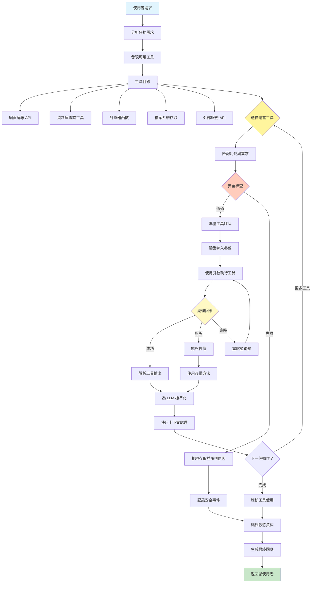

[English](../05-tool-use.md) | **繁體中文**

# 05. 工具使用模式 (Tool Use / Function Calling Pattern)

## 何時使用

- **外部資料存取**：當代理需要即時或動態資訊時
- **系統整合**：當連接到資料庫、API 或服務時
- **計算任務**：當需要精確計算或資料處理時
- **檔案操作**：當讀取、寫入或操作檔案時
- **動作執行**：當代理需要執行具體動作時
- **多步驟工作流程**：當結合 AI 推理與工具執行時

## 視覺化流程

## 適用位置

- **研究助理**：網頁搜尋、文件檢索、事實查核
- **資料分析工作流程**：資料庫查詢、計算、視覺化
- **DevOps 自動化**：系統命令、部署工具、監控
- **客戶服務**：CRM 存取、工單管理、知識庫查詢
- **內容管理**：檔案操作、發佈工具、資產管理

## 優點

- **功能擴展**：代理可以執行超越文字生成的動作
- **即時資料**：存取訓練資料中不存在的當前資訊
- **精確度**：精確計算和確定性操作
- **整合**：與現有系統和服務的無縫連接
- **自動化**：無需人工介入的端到端工作流程
- **彈性**：根據任務需求動態選擇工具
- **可稽核性**：清楚記錄所有工具使用和參數

## 缺點

- **安全風險**：必須仔細控制工具存取
- **錯誤傳播**：工具故障可能破壞整個工作流程
- **延遲增加**：每次工具呼叫增加處理時間
- **成本累積**：外部 API 呼叫可能產生費用
- **複雜性**：管理工具架構和錯誤處理
- **依賴風險**：依賴外部服務可用性
- **資料敏感性**：需要仔細處理憑證和私人資料

## 實際案例

1. **財務分析助理**：
   - 即時報價的股票價格 API
   - 投資組合計算的計算器
   - 歷史資料的資料庫查詢
   - 視覺化的圖表生成工具
   - 報告分發的電子郵件 API

2. **程式碼開發助手**：
   - 讀取/寫入程式碼的檔案系統存取
   - 程式碼執行的編譯器/直譯器
   - 版本控制的 Git 命令
   - 驗證的測試框架
   - 文件生成器

3. **電子商務訂單管理**：
   - 庫存資料庫查詢
   - 支付處理 API
   - 物流服務整合
   - 電子郵件/簡訊通知工具
   - CRM 系統更新

4. **研究論文助理**：
   - 學術資料庫搜尋（PubMed、arXiv）
   - 引用管理工具
   - PDF 解析和提取
   - 參考文獻格式化工具
   - 抄襲檢查 API

5. **智慧家居控制器**：
   - IoT 裝置 API（燈光、恆溫器）
   - 氣象服務整合
   - 排程的日曆存取
   - 能源監控工具
   - 安全系統控制

6. **人力資源招聘系統**：
   - 履歷解析工具
   - LinkedIn/求職看板 API
   - 日曆排程工具
   - 電子郵件自動化
   - 背景調查服務
   - 視訊面試平台

## 原始檔案

- **模式討論**：[pattern-discussion/tool-use.md](../../pattern-discussion/tool-use.md)
- **Mermaid 來源**：[mermaid-diagrams/tool-use.mmd](../../mermaid-diagrams/tool-use.mmd)
