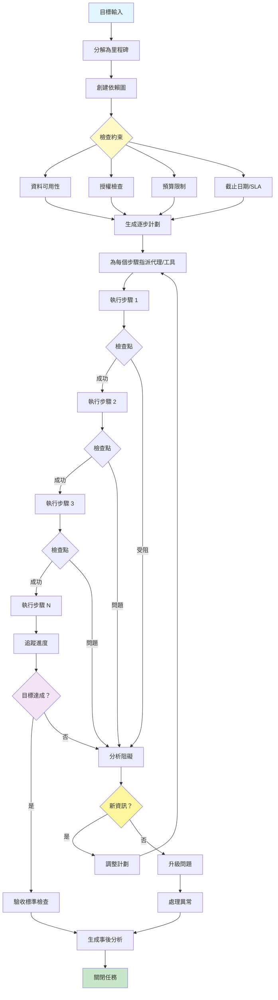

[English](../06-planning.md) | **繁體中文**

# 06. 規劃模式 (Planning Pattern)

## 何時使用

- **複雜的多步驟專案**：當任務有多個依賴項和階段時
- **目標導向工作流程**：當朝向特定的、可衡量的目標工作時
- **資源受限操作**：當管理預算、時間或計算限制時
- **不確定環境**：當需要適應變化條件時
- **協作任務**：當協調多個代理或工具時
- **長期執行流程**：當任務跨越延長的時間框架時

## 視覺化流程

## 適用位置

- **專案管理自動化**：將專案分解為可執行任務
- **軟體開發**：從需求到部署規劃功能
- **研究專案**：組織文獻回顧、實驗和分析
- **內容製作**：規劃多部分內容系列或活動
- **業務流程自動化**：編排複雜的業務工作流程

## 優點

- **策略執行**：將被動代理轉變為主動規劃者
- **依賴管理**：處理複雜的任務相互依賴
- **資源最佳化**：在步驟之間有效分配資源
- **適應性**：可以根據新資訊調整計劃
- **進度可見性**：清楚追蹤里程碑完成
- **風險緩解**：及早識別阻礙和問題
- **可重用性**：計劃可以模板化和重用

## 缺點

- **前期開銷**：規劃階段增加初始延遲
- **剛性風險**：過度規劃可能降低彈性
- **複雜性**：管理計劃狀態和依賴項具有挑戰性
- **預測錯誤**：初始計劃可能基於不正確的假設
- **重新規劃成本**：在執行過程中調整計劃可能代價高昂
- **上下文限制**：長計劃可能超過上下文視窗
- **協調開銷**：管理多個代理增加複雜性

## 實際案例

1. **軟體功能開發**：
   - 需求分析和設計
   - 開發任務分解
   - 測試策略規劃
   - 部署排程
   - 文件準備
   - 回滾規劃

2. **行銷活動執行**：
   - 市場研究和分析
   - 內容創作時程表
   - 頻道選擇和時機
   - 預算分配
   - 效能監控設定
   - A/B 測試計劃

3. **學術研究專案**：
   - 文獻回顧規劃
   - 假設制定
   - 實驗設計
   - 資料收集時程表
   - 分析方法論
   - 出版時間表

4. **資料遷移專案**：
   - 資料稽核和對映
   - 架構設計
   - 遷移腳本開發
   - 測試階段
   - 推出時程表
   - 驗證檢查點

5. **產品發佈規劃**：
   - 開發里程碑
   - 行銷準備
   - 銷售賦能
   - 支援文件
   - 發佈活動協調
   - 發佈後監控

6. **合規稽核準備**：
   - 需求識別
   - 文件收集
   - 差距分析
   - 補救規劃
   - 審查排程
   - 報告生成

## 原始檔案

- **模式討論**：[pattern-discussion/planning.md](../../pattern-discussion/planning.md)
- **Mermaid 來源**：[mermaid-diagrams/planning.mmd](../../mermaid-diagrams/planning.mmd)
