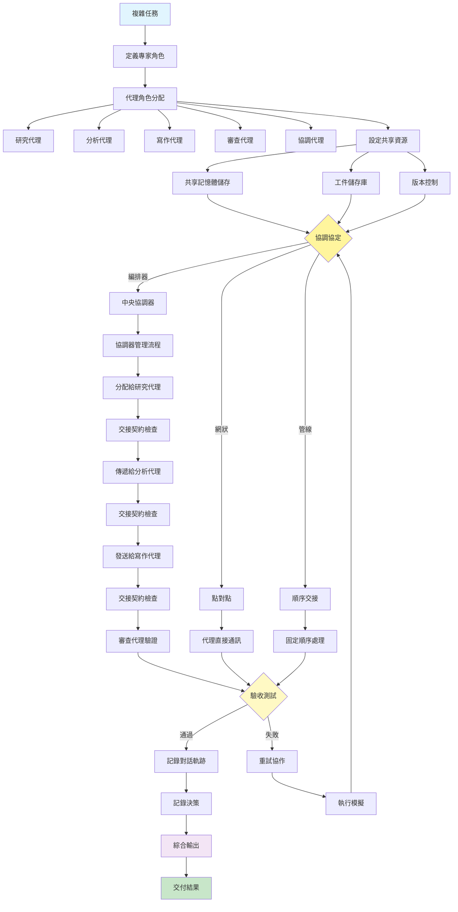

[English](../07-multi-agent-collaboration.md) | **繁體中文**

# 07. 多代理協作模式 (Multi-Agent Collaboration Pattern)

## 何時使用

- **複雜的多面向問題**：需要多樣化專業知識的任務
- **平行工作流**：當子任務可以同時處理時
- **專業知識需求**：不同方面需要不同技能
- **規模和效率**：從分工中受益的大型專案
- **透過專業化提升品質**：當專業知識深度很重要時
- **迭代精煉**：需要多個觀點的任務

## 視覺化流程

## 適用位置

- **軟體開發團隊**：設計、編碼、測試、文件代理
- **內容製作管線**：研究、寫作、編輯、出版代理
- **財務分析**：資料收集、分析、風險評估、報告代理
- **客戶服務**：分流、技術、帳務、升級代理
- **研究專案**：文獻回顧、實驗、分析、綜合代理

## 優點

- **專業化好處**：每個代理針對特定任務最佳化
- **平行處理**：多個代理同時工作
- **可擴展性**：容易添加新的專家代理
- **模組化**：代理可以獨立開發和更新
- **健壯性**：一個代理的故障不會使整個系統崩潰
- **知識分離**：領域之間的清晰界限
- **品質提升**：多個觀點和驗證步驟

## 缺點

- **協調複雜性**：管理代理間通訊具有挑戰性
- **開銷成本**：多個代理意味著多個 API 呼叫和資源
- **上下文管理**：在代理之間維護共同理解
- **除錯困難**：追蹤多個代理之間的問題
- **延遲累積**：代理之間的交接增加延遲
- **衝突解決**：代理可能不同意或產生不相容的輸出
- **狀態同步**：保持共享記憶體一致

## 實際案例

1. **自動化新聞製作**：
   - 新聞收集代理：從來源收集突發新聞
   - 事實查核代理：驗證聲明和來源
   - 寫作代理：以適當結構起草文章
   - 編輯代理：改進清晰度和風格
   - SEO 代理：為搜尋引擎最佳化
   - 發佈代理：格式化並發佈到 CMS

2. **投資分析系統**：
   - 市場資料代理：收集即時市場資訊
   - 基本面分析代理：評估公司財務
   - 技術分析代理：分析價格模式
   - 風險評估代理：計算投資組合風險
   - 報告生成代理：創建投資建議
   - 合規代理：確保法規遵循

3. **電子商務產品發佈**：
   - 市場研究代理：分析競爭和需求
   - 產品描述代理：創建引人注目的文案
   - 定價代理：確定最佳定價策略
   - 庫存代理：管理庫存水準
   - 行銷代理：規劃促銷活動
   - 客戶服務代理：準備常見問題和支援材料

4. **法律文件審查**：
   - 文件解析代理：提取關鍵資訊
   - 條款分析代理：識別重要條款
   - 風險識別代理：標記潛在問題
   - 合規檢查代理：確保法規遵循
   - 摘要生成代理：創建執行摘要
   - 建議代理：建議修改

5. **軟體錯誤解決**：
   - 錯誤分流代理：分類和優先處理問題
   - 程式碼分析代理：識別受影響的組件
   - 解決方案設計代理：提出修復方案
   - 實作代理：生成修補程式碼
   - 測試代理：創建並執行測試案例
   - 文件代理：更新文件和版本說明

6. **學術論文審查**：
   - 文獻回顧代理：尋找相關工作
   - 方法論批評代理：評估研究方法
   - 統計驗證代理：檢查計算
   - 寫作品質代理：評估清晰度和結構
   - 引用檢查代理：驗證參考文獻
   - 摘要寫作代理：創建審查摘要

## 原始檔案

- **模式討論**：[pattern-discussion/multi-agent-collaboration.md](../../pattern-discussion/multi-agent-collaboration.md)
- **Mermaid 來源**：[mermaid-diagrams/multi-agent-collaboration.mmd](../../mermaid-diagrams/multi-agent-collaboration.mmd)
