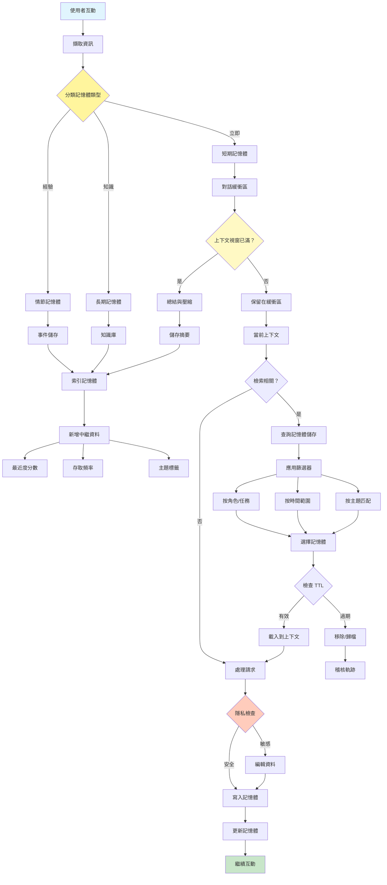

[English](../08-memory-management.md) | **繁體中文**

# 08. 記憶體管理模式 (Memory Management Pattern)

## 何時使用

- **對話連續性**：在互動之間維護上下文
- **個人化**：記住使用者偏好和歷史
- **學習系統**：隨時間累積知識
- **複雜工作流程**：追蹤多個步驟的狀態
- **使用者會話**：管理多輪對話
- **知識累積**：隨時間建立領域專業知識

## 視覺化流程

## 適用位置

- **客戶服務機器人**：記住先前的互動和問題
- **個人助理**：追蹤使用者偏好和例行程序
- **教育導師**：記住學生進度和弱點
- **專案管理**：維護專案上下文和歷史
- **研究助理**：在會話之間累積發現

## 優點

- **上下文保存**：維護對話連續性
- **個人化**：根據歷史提供量身定制的回應
- **學習能力**：通過經驗提高效能
- **效率**：避免重複先前的工作
- **使用者體驗**：更自然、更像人類的互動
- **知識建構**：隨時間累積有價值的資訊
- **狀態管理**：處理複雜的多步驟流程

## 缺點

- **儲存成本**：記憶體系統需要資料庫基礎設施
- **隱私顧慮**：儲存使用者資料引發隱私問題
- **上下文視窗限制**：必須管理有限的標記預算
- **檢索複雜性**：尋找相關記憶體可能具有挑戰性
- **資料過時**：舊記憶體可能變得過時或無關
- **同步問題**：在分散式系統中管理記憶體
- **效能開銷**：記憶體操作增加延遲

## 實際案例

1. **客戶支援系統**：
   - 短期：當前對話上下文
   - 情節：先前的支援工單和解決方案
   - 長期：客戶偏好和歷史
   - 長對話的自動總結
   - 符合隱私的資料保留政策

2. **個人購物助理**：
   - 短期：當前購物會話
   - 情節：過去的購買和退貨
   - 長期：風格偏好和尺寸
   - 季節性偏好追蹤
   - 預算和消費模式記憶體

3. **程式碼開發助理**：
   - 短期：當前編碼會話
   - 情節：最近的錯誤修復和功能
   - 長期：專案架構和慣例
   - 技術堆疊偏好
   - 常見錯誤模式和解決方案

4. **醫療諮詢機器人**：
   - 短期：當前症狀討論
   - 情節：最近的預約和治療
   - 長期：病史和過敏
   - 藥物追蹤
   - HIPAA 合規的資料處理

5. **教育導師**：
   - 短期：當前課程上下文
   - 情節：最近的測驗結果和作業
   - 長期：學習風格和進度
   - 概念掌握追蹤
   - 常見錯誤模式

6. **專案管理助理**：
   - 短期：當前任務討論
   - 情節：最近的會議和決策
   - 長期：專案目標和約束
   - 團隊成員偏好
   - 歷史專案模式

## 原始檔案

- **模式討論**：[pattern-discussion/memory-management.md](../../pattern-discussion/memory-management.md)
- **Mermaid 來源**：[mermaid-diagrams/memory-management.mmd](../../mermaid-diagrams/memory-management.mmd)
