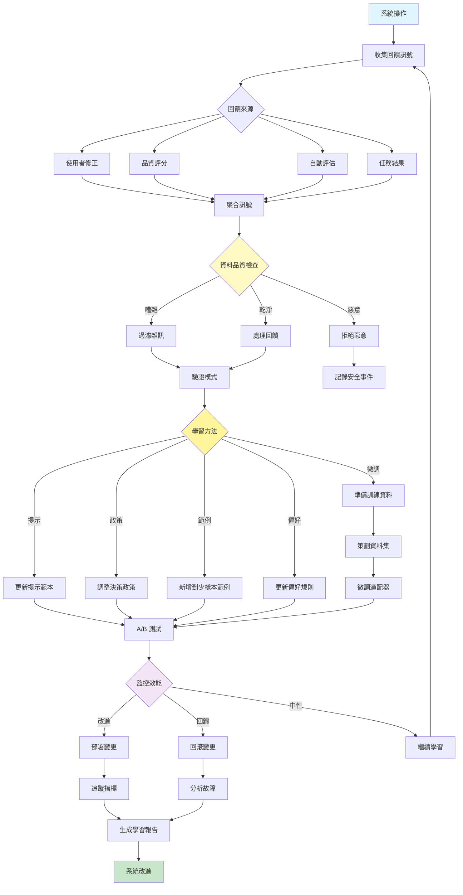

[English](../09-learning-and-adaptation.md) | **繁體中文**

# 09. 學習與適應模式 (Learning and Adaptation Pattern)

## 何時使用

- **效能最佳化**：當系統需要隨時間改進時
- **使用者個人化**：適應個別使用者偏好
- **錯誤減少**：從錯誤中學習以防止重複
- **領域專業化**：在特定領域建立專業知識
- **動態環境**：適應變化的條件
- **回饋整合**：當使用者修正可用時

## 視覺化流程

## 適用位置

- **客戶服務**：從已解決的工單和滿意度分數中學習
- **內容推薦**：適應使用者參與模式
- **程式碼助理**：從程式碼審查回饋中學習
- **教育系統**：適應學生學習模式
- **決策支援**：根據結果改進預測

## 優點

- **持續改進**：系統隨使用而進步
- **個人化**：適應特定使用者或領域
- **錯誤減少**：學會避免過去的錯誤
- **效率提升**：隨時間最佳化常見模式
- **健壯性**：適應變化的需求
- **使用者滿意度**：更好地與期望保持一致
- **知識保留**：保留學習到的改進

## 缺點

- **回饋品質**：依賴可靠的回饋訊號
- **訓練成本**：微調和測試需要資源
- **回歸風險**：變更可能降低效能
- **複雜性**：管理學習管線具有挑戰性
- **資料需求**：需要足夠的回饋量
- **對抗性風險**：易受投毒攻擊
- **漂移管理**：必須處理概念漂移

## 實際案例

1. **客戶支援聊天機器人**：
   - 從代理接管和修正中學習
   - 根據滿意度評分調整回應
   - 從成功的解決方案更新常見問題答案
   - 從錯誤標記的查詢改進意圖分類
   - 根據客戶回饋個人化語氣

2. **程式碼審查助理**：
   - 從接受/拒絕的建議中學習
   - 適應團隊編碼標準
   - 根據開發者回饋改進
   - 從合併的拉取請求更新模式
   - 學習專案特定的慣例

3. **內容寫作助理**：
   - 從編輯修正中學習
   - 適應品牌語調指南
   - 從效能資料改進 SEO 策略
   - 根據參與度指標更新風格
   - 為不同內容類型個人化

4. **財務諮詢系統**：
   - 從投資結果中學習
   - 適應市場條件
   - 從歷史資料改進預測
   - 從損失更新風險模型
   - 根據客戶檔案個人化策略

5. **醫療診斷助理**：
   - 從確認的診斷中學習
   - 適應當地疾病模式
   - 從醫生修正中改進
   - 從新研究更新協定
   - 根據患者人口統計個人化

6. **電子商務推薦引擎**：
   - 從購買行為中學習
   - 適應季節性趨勢
   - 從退貨/評論資料改進
   - 從瀏覽模式更新偏好
   - 為個別購物者個人化

## 原始檔案

- **模式討論**：[pattern-discussion/learning-and-adaptation.md](../../pattern-discussion/learning-and-adaptation.md)
- **Mermaid 來源**：[mermaid-diagrams/learning-and-adaptation.mmd](../../mermaid-diagrams/learning-and-adaptation.mmd)
