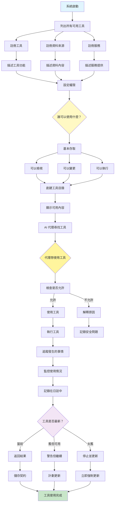

[English](../10-model-context-protocol.md) | **繁體中文**

# 10. 模型上下文協定模式 (Model Context Protocol Pattern)

## 何時使用

- **企業系統**：建構可擴展的、生產級 AI 應用程式
- **多工具整合**：連接到多樣化的外部資源
- **標準化需求**：確保一致的通訊介面
- **安全需求**：管理存取控制和權限
- **動態環境**：隨時間變化或演進的資源
- **互操作性**：使不同的 AI 系統能夠協同工作

## 視覺化流程

## 適用位置

- **企業 AI 平台**：標準化工具和資料存取
- **多供應商整合**：連接不同的 AI 服務
- **微服務架構**：AI 代理存取分散式服務
- **雲原生應用程式**：跨環境管理資源
- **API 閘道**：集中 AI 系統對外部資源的存取

## 優點

- **標準化**：所有整合的通用介面
- **可發現性**：代理可以動態尋找可用資源
- **安全性**：內建身份驗證和授權
- **版本控制**：優雅處理 API 演進
- **可觀察性**：全面的記錄和追蹤
- **可重用性**：一次編寫，跨多個代理使用
- **可擴展性**：為企業級部署而設計

## 缺點

- **實作開銷**：需要前期協定設定
- **複雜性**：需要管理額外的抽象層
- **學習曲線**：團隊需要理解 MCP 概念
- **遷移努力**：現有整合需要轉換
- **效能開銷**：協定層增加延遲
- **供應商支援**：需要生態系統採用
- **除錯複雜性**：故障排除的額外層面

## 實際案例

1. **企業資料平台**：
   - 統一存取資料庫、API 和檔案系統
   - 不同團隊的基於角色的存取控制
   - 合規需求的稽核記錄
   - 架構演進的版本管理
   - 可用資料來源的發現服務

2. **多雲 AI 服務**：
   - AWS、Azure、GCP 服務的標準化介面
   - 憑證管理和輪換
   - 跨雲提供商的服務發現
   - 成本追蹤和資源最佳化
   - 故障轉移和冗餘處理

3. **醫療 AI 系統**：
   - 符合 HIPAA 的資料存取協定
   - 患者資料隱私控制
   - 醫療裝置整合
   - 電子健康記錄連接
   - 法規遵循的稽核軌跡

4. **金融服務平台**：
   - 市場資料源整合
   - 交易系統連接
   - 風險管理工具存取
   - 合規檢查服務
   - 交易稽核記錄

5. **製造 IoT 整合**：
   - 感測器資料收集協定
   - 設備控制介面
   - 品質保證系統連接
   - 供應鏈資料存取
   - 預測性維護工具

6. **研究計算平台**：
   - 科學資料庫存取
   - 計算叢集作業提交
   - 實驗追蹤系統
   - 協作工具整合
   - 研究工件的版本控制

## 原始檔案

- **模式討論**：[pattern-discussion/model-context-protocol.md](../../pattern-discussion/model-context-protocol.md)
- **Mermaid 來源**：[mermaid-diagrams/model-context-protocol.mmd](../../mermaid-diagrams/model-context-protocol.mmd)
