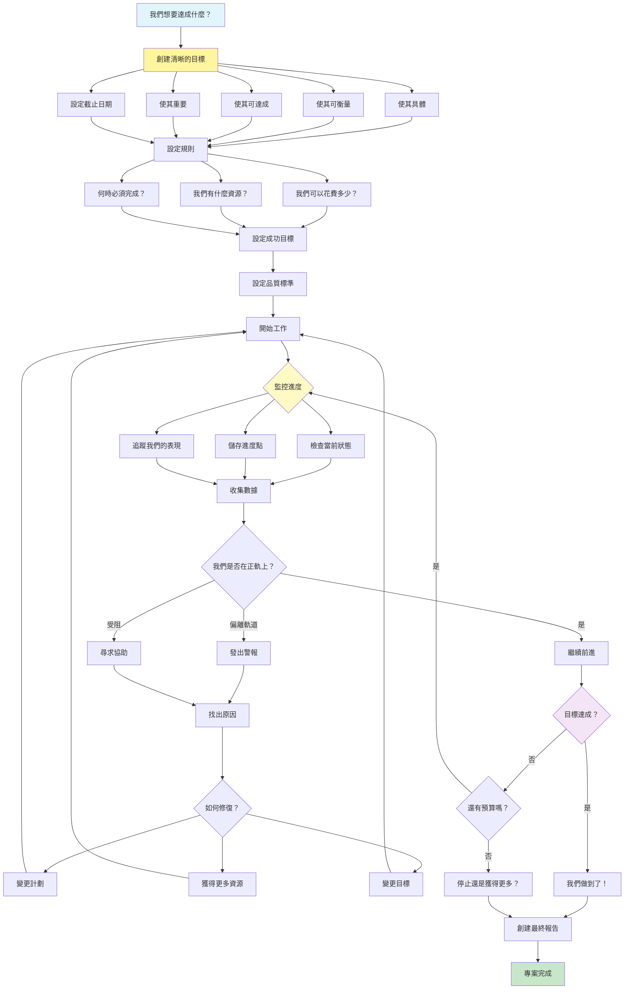

[English](../11-goal-setting-and-monitoring.md) | **繁體中文**

# 11. 目標設定與監控模式 (Goal Setting and Monitoring Pattern)

## 何時使用

- **自主運作**：當代理獨立朝向目標工作時
- **複雜專案**：需要進度追蹤的多步驟任務
- **資源管理**：在約束條件下運作時
- **效能最佳化**：達成特定可衡量的結果
- **合規需求**：達到 SLA 和品質標準
- **策略執行**：使代理行動與業務目標保持一致

## 視覺化流程

## 適用位置

- **專案自動化**：管理專案里程碑和交付成果
- **銷售管線**：追蹤目標和轉換目標
- **內容製作**：達到出版時程表和品質標準
- **系統最佳化**：達成效能基準
- **成本管理**：在預算約束內運作

## 優點

- **目的驅動**：代理朝向清晰目標工作
- **自我評估**：持續評估進度
- **適應性**：動態調整以適應變化條件
- **問責制**：清晰的指標和成功標準
- **資源效率**：基於優先順序的最佳分配
- **早期警告**：主動檢測問題
- **可衡量的結果**：可量化的成功指標

## 缺點

- **開銷複雜性**：目標管理增加系統複雜性
- **剛性約束**：可能限制創意問題解決
- **衡量挑戰**：某些目標難以量化
- **錯誤指標**：最佳化錯誤指標的風險
- **資源密集**：持續監控需要資源
- **目標衝突**：多個目標可能競爭
- **過度最佳化**：可能為了指標而犧牲品質

## 實際案例

1. **銷售自動化系統**：
   - 每月收入目標與每日追蹤
   - 潛在客戶轉換率目標
   - 客戶獲取成本限制
   - 活動指標（電話、電子郵件、會議）
   - 風險交易的自動升級
   - 效能儀表板生成

2. **內容出版平台**：
   - 文章出版時程表
   - 品質分數閾值
   - SEO 效能目標
   - 參與度指標目標
   - 每種內容類型的預算分配
   - 帶警報的截止日期管理

3. **DevOps 管線**：
   - 部署頻率目標
   - 平均恢復時間 (MTTR) 目標
   - 測試覆蓋率需求
   - 效能基準
   - 每次部署的成本限制
   - 指標違規時自動回滾

4. **客戶服務中心**：
   - 首次回應時間 SLA
   - 解決率目標
   - 客戶滿意度分數
   - 工單量管理
   - 每次互動的成本限制
   - 升級閾值

5. **行銷活動管理器**：
   - 每個活動的 ROI 目標
   - 轉換率目標
   - 預算分配限制
   - A/B 測試成功標準
   - 頻道效能指標
   - 即時最佳化觸發器

6. **供應鏈最佳化**：
   - 庫存水準目標
   - 訂單履行 SLA
   - 成本降低目標
   - 交付時間目標
   - 品質合規率
   - 自動重新訂購觸發器

## 原始檔案

- **模式討論**：[pattern-discussion/goal-setting-and-monitoring.md](../../pattern-discussion/goal-setting-and-monitoring.md)
- **Mermaid 來源**：[mermaid-diagrams/goal-setting-and-monitoring.mmd](../../mermaid-diagrams/goal-setting-and-monitoring.mmd)
