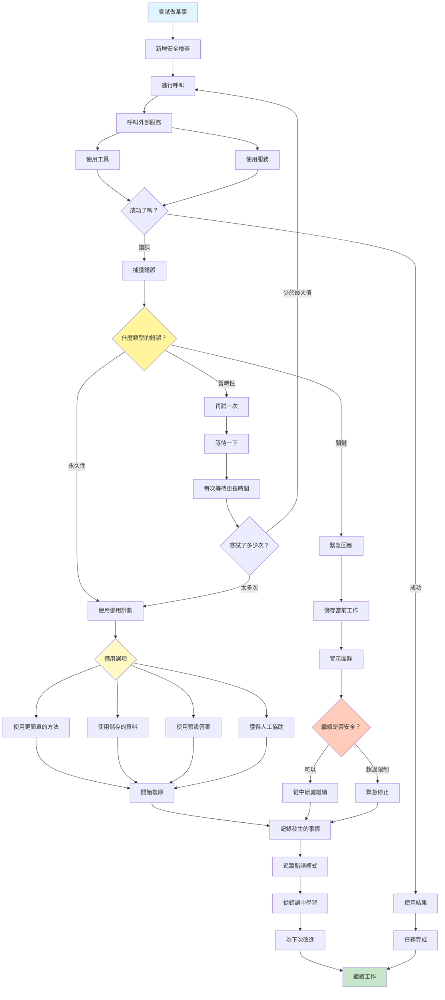

[English](../12-exception-handling-and-recovery.md) | **繁體中文**

# 12. 異常處理與復原模式 (Exception Handling and Recovery Pattern)

## 何時使用

- **生產環境**：任何需要高可靠性的系統
- **外部依賴**：當依賴 API 或服務時
- **關鍵操作**：不能完全失敗的任務
- **不可預測的輸入**：處理邊緣案例和異常
- **網路操作**：管理連線問題
- **資源約束**：處理限制和配額

## 視覺化流程

## 適用位置

- **API 整合**：處理服務中斷和速率限制
- **資料管線**：管理損壞資料和處理故障
- **面向使用者的系統**：維護服務可用性
- **金融交易**：確保交易完整性
- **IoT 系統**：處理裝置故障和連線問題

## 優點

- **可靠性**：系統儘管失敗仍繼續運作
- **優雅降級**：在完整服務不可用時提供部分功能
- **自我修復**：從暫時性問題自動復原
- **使用者體驗**：最小化對使用者的干擾
- **除錯支援**：全面的錯誤記錄
- **學習能力**：隨時間改進處理
- **狀態保存**：可以在中斷後恢復

## 缺點

- **複雜性增加**：錯誤處理增加程式碼複雜性
- **效能開銷**：try/catch 和重試增加延遲
- **誤判**：可能在不必要時重試
- **資源消耗**：重試和後備使用資源
- **級聯故障**：不良處理可能使問題惡化
- **測試困難**：難以測試所有故障情境
- **維護負擔**：錯誤處理程式碼需要更新

## 實際案例

1. **支付處理系統**：
   - 使用退避重試失敗的交易
   - 後備到替代支付閘道
   - 儲存交易狀態以供人工審查
   - 通知財務團隊關鍵故障
   - 持續失敗時自動退款

2. **資料整合管線**：
   - 優雅處理格式錯誤的資料
   - 使用抖動重試失敗的 API 呼叫
   - 服務不可用時使用快取資料
   - 檢查點進度以供恢復
   - 資料品質問題警報

3. **聊天機器人客戶服務**：
   - 錯誤時後備到更簡單的回應
   - 卡住時升級到人工代理
   - 儲存對話狀態以供交接
   - 重試知識庫查詢
   - 預設使用常見問題回應

4. **內容傳遞網路**：
   - 重試失敗的來源擷取
   - 來源停機時提供陳舊內容
   - 路由到備用伺服器
   - 實作斷路器
   - 地理故障轉移策略

5. **機器學習管線**：
   - 處理模型載入故障
   - 後備到更簡單的模型
   - 重試失敗的預測
   - 快取頻繁的預測
   - 功能的優雅降級

6. **IoT 裝置管理**：
   - 重試失敗的裝置命令
   - 為離線裝置排隊命令
   - 使用最後已知狀態作為後備
   - 實作看門狗計時器
   - 自動裝置重啟協定

## 原始檔案

- **模式討論**：[pattern-discussion/exception-handling-and-recovery.md](../../pattern-discussion/exception-handling-and-recovery.md)
- **Mermaid 來源**：[mermaid-diagrams/exception-handling-and-recovery.mmd](../../mermaid-diagrams/exception-handling-and-recovery.mmd)
