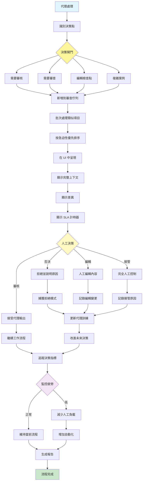

[English](../13-human-in-the-loop.md) | **繁體中文**

# 13. 人工介入模式 (Human-in-the-Loop Pattern)

## 何時使用

- **高風險決策**：當錯誤會造成重大後果時
- **法規遵循**：法律原因需要人工監督
- **品質保證**：確保輸出符合標準
- **邊緣案例**：處理不尋常或模糊的情況
- **訓練資料生成**：使用人類回饋來改進
- **建立信任**：透過人工驗證逐步自動化

## 視覺化流程

## 適用位置

- **內容審核**：審查敏感或邊緣內容
- **醫療診斷**：醫生驗證 AI 建議
- **財務核准**：大額交易的人工授權
- **法律文件審查**：律師監督合約
- **招聘決策**：人工審查 AI 篩選的候選人

## 優點

- **品質保證**：人工判斷捕獲 AI 錯誤
- **合規性**：符合法規要求
- **學習來源**：人類回饋改進系統
- **信任**：使用者對人工監督有信心
- **彈性**：人類能妥善處理邊緣案例
- **問責制**：清晰的責任鏈
- **風險緩解**：防止代價高昂的錯誤

## 缺點

- **可擴展性限制**：人力頻寬限制吞吐量
- **成本增加**：人工審查員很昂貴
- **延遲增加**：等待人工回應延遲流程
- **不一致性**：不同的人做出不同的決策
- **疲勞效應**：審查員疲倦時品質下降
- **訓練需求**：審查員需要領域專業知識
- **可用性問題**：24/7 全天候覆蓋具有挑戰性

## 實際案例

1. **內容審核平台**：
   - AI 標記潛在問題內容
   - 人工審查員做出最終決定
   - 複雜案例升級給資深審核員
   - 審查員回饋訓練 AI 模型
   - 疲勞監控和輪班時程表

2. **貸款核准系統**：
   - AI 評估信用風險
   - 人工審查邊界案例
   - 大額貸款需要人工核准
   - 拒絕提供解釋
   - 合規的稽核軌跡

3. **醫療影像分析**：
   - AI 檢測潛在異常
   - 放射科醫生確認診斷
   - 關鍵發現優先審查
   - 複雜案例尋求第二意見
   - 從修正中持續學習

4. **履歷篩選**：
   - AI 過濾初步申請
   - 人力資源審查入圍候選人
   - 人工多元性檢查
   - 回饋改進篩選演算法
   - 最終面試始終由人工主導

5. **翻譯品質控制**：
   - AI 執行初步翻譯
   - 人類語言學家審查和編輯
   - 文化敏感性檢查
   - 技術術語驗證
   - 風格一致性執行

6. **自動駕駛車輛監控**：
   - AI 處理正常駕駛
   - 遠端操作員處理邊緣案例
   - 安全駕駛員接管能力
   - 事件審查和分析
   - 從介入中持續改進

## 原始檔案

- **模式討論**：[pattern-discussion/human-in-the-loop.md](../../pattern-discussion/human-in-the-loop.md)
- **Mermaid 來源**：[mermaid-diagrams/human-in-the-loop.mmd](../../mermaid-diagrams/human-in-the-loop.mmd)
