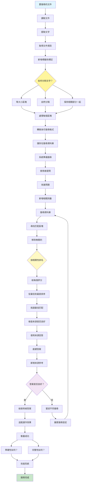

[English](../14-knowledge-retrieval-rag.md) | **繁體中文**

# 14. 知識檢索模式 (RAG - Retrieval-Augmented Generation Pattern)

## 何時使用

- **動態知識需求**：存取最新資訊
- **大型文件集合**：查詢廣泛的知識庫
- **特定領域應用**：專業知識整合
- **事實準確性需求**：在來源中建立回應基礎
- **引用需求**：提供可驗證的參考
- **減少幻覺**：確保事實性回應

## 視覺化流程

## 適用位置

- **企業搜尋**：內部文件檢索系統
- **客戶支援**：知識庫查詢
- **研究助理**：學術論文檢索
- **法律研究**：案例法和法規搜尋
- **技術文件**：API 和產品文件存取

## 優點

- **準確性**：回應基於真實來源
- **可驗證性**：引用啟用事實查核
- **可擴展性**：處理大量文件集合
- **即時性**：存取最新資訊
- **領域專業知識**：專業知識整合
- **減少幻覺**：較少捏造事實
- **彈性**：容易更新知識庫

## 缺點

- **基礎設施需求**：需要向量資料庫和儲存
- **處理開銷**：嵌入和索引成本
- **檢索品質**：依賴於分塊和匹配
- **上下文限制**：檢索的區塊可能缺乏上下文
- **延遲**：額外的檢索步驟增加延遲
- **維護**：知識庫需要定期更新
- **相關性挑戰**：可能檢索無關資訊

## 實際案例

1. **企業知識管理**：
   - 索引公司政策和程序
   - 檢索相關的人力資源指南
   - 搜尋技術文件
   - 存取歷史專案資料
   - 為員工提供有來源的答案

2. **法律研究平台**：
   - 索引案例法和法規
   - 檢索相關先例
   - 搜尋法律評論
   - 尋找類似案例
   - 生成帶引用的摘要

3. **醫療資訊系統**：
   - 索引醫學文獻
   - 檢索治療指南
   - 搜尋藥物交互作用
   - 存取臨床試驗資料
   - 提供有實證基礎的建議

4. **學術研究助理**：
   - 索引研究論文
   - 檢索相關研究
   - 跨學科搜尋
   - 尋找引用網路
   - 生成文獻回顧

5. **技術支援系統**：
   - 索引產品文件
   - 檢索故障排除指南
   - 搜尋錯誤代碼資料庫
   - 存取配置範例
   - 提供帶參考的解決方案步驟

6. **新聞聚合服務**：
   - 即時索引新聞文章
   - 檢索相關報導
   - 搜尋歷史檔案
   - 尋找相關故事
   - 生成帶來源的摘要

## 原始檔案

- **模式討論**：[pattern-discussion/knowledge-retrieval-rag.md](../../pattern-discussion/knowledge-retrieval-rag.md)
- **Mermaid 來源**：[mermaid-diagrams/knowledge-retrieval-rag.mmd](../../mermaid-diagrams/knowledge-retrieval-rag.mmd)
