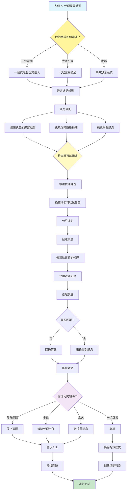

[English](../15-inter-agent-communication-a2a.md) | **繁體中文**

# 15. 代理間通訊模式 (A2A - Agent-to-Agent Communication Pattern)

## 何時使用

- **複雜工作流程**：需要多個專業代理的任務
- **模組化系統**：建構可組合的代理架構
- **分散式處理**：代理在不同位置執行
- **可擴展架構**：需要成長的系統
- **協作任務**：代理共同處理問題
- **服務導向設計**：代理作為微服務

## 視覺化流程

## 適用位置

- **企業自動化**：協調業務流程代理
- **研究系統**：代理協作進行分析
- **內容製作**：內容創作代理的管線
- **交易系統**：代理協調財務決策
- **智慧城市系統**：IoT 和服務代理通訊

## 優點

- **模組化**：代理責任的清晰分離
- **可擴展性**：容易向系統添加新代理
- **彈性**：可用不同的通訊模式
- **故障隔離**：代理故障不會使系統崩潰
- **可重用性**：代理可在不同工作流程中重用
- **除錯支援**：訊息追蹤有助於故障排除
- **平行處理**：代理可以同時工作

## 缺點

- **複雜度開銷**：通訊協定增加複雜性
- **延遲累積**：訊息傳遞增加延遲
- **協調挑戰**：管理代理互動
- **除錯困難**：追蹤分散式對話
- **狀態管理**：在代理之間維持一致性
- **網路依賴**：易受通訊故障影響
- **安全顧慮**：需要代理間身份驗證

## 實際案例

1. **電子商務訂單處理**：
   - 庫存代理檢查庫存可用性
   - 定價代理計算總成本
   - 支付代理處理交易
   - 物流代理安排配送
   - 通知代理更新客戶
   - 編排器協調整個流程

2. **新聞製作管線**：
   - 爬蟲代理收集新聞來源
   - 事實查核代理驗證資訊
   - 寫作代理創建文章
   - 編輯代理審查內容
   - 發佈代理發布到 CMS
   - 分析代理追蹤效能

3. **財務分析平台**：
   - 資料代理收集市場資訊
   - 技術代理執行圖表分析
   - 基本面代理分析財務
   - 風險代理評估投資組合曝險
   - 報告代理生成建議
   - 合規代理確保法規

4. **智慧製造系統**：
   - 感測器代理監控設備
   - 品質代理檢查生產
   - 維護代理安排維修
   - 庫存代理管理供應品
   - 規劃代理最佳化時程表
   - 控制代理協調操作

5. **醫療協調**：
   - 分流代理評估症狀
   - 診斷代理建議測試
   - 專家代理提供專業知識
   - 治療代理建議療法
   - 藥房代理管理藥物
   - 排程代理預約

6. **研究協作平台**：
   - 文獻代理搜尋論文
   - 資料代理管理資料集
   - 分析代理執行實驗
   - 視覺化代理創建圖表
   - 寫作代理起草報告
   - 審查代理檢查品質

## 原始檔案

- **模式討論**：[pattern-discussion/inter-agent-communication-a2a.md](../../pattern-discussion/inter-agent-communication-a2a.md)
- **Mermaid 來源**：[mermaid-diagrams/inter-agent-communication-a2a.mmd](../../mermaid-diagrams/inter-agent-communication-a2a.mmd)
