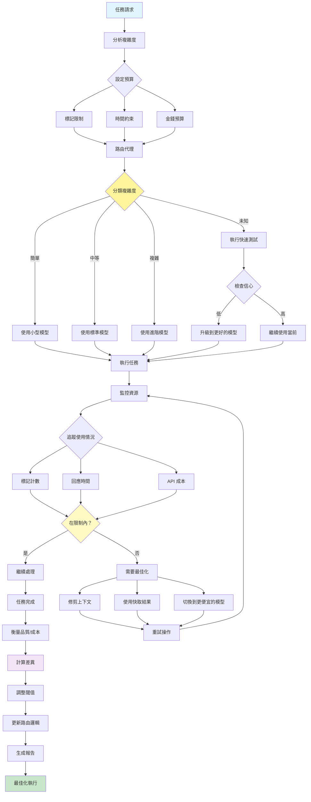

[English](../16-resource-aware-optimization.md) | **繁體中文**

# 16. 資源感知最佳化模式 (Resource-Aware Optimization Pattern)

## 何時使用

- **成本敏感操作**：當管理 API 或計算成本時
- **高容量處理**：最佳化大規模操作
- **可變工作負載**：不同任務需要不同資源
- **預算約束**：在財務限制內運作
- **效能需求**：平衡速度與成本
- **多租戶系統**：在使用者之間公平分配資源

## 視覺化流程

## 適用位置

- **SaaS 平台**：管理每個客戶的資源使用
- **批次處理**：最佳化大型資料處理作業
- **即時系統**：平衡延遲和成本
- **開發環境**：測試使用較便宜的模型
- **生產系統**：最佳化營運成本

## 優點

- **成本降低**：在 API 和計算成本上大幅節省
- **效能最佳化**：為每個任務適當調整資源
- **可擴展性**：有效的資源使用實現成長
- **彈性**：動態調整工作負載變化
- **預算控制**：可預測的營運成本
- **品質保持**：在需要時保持輸出品質
- **自動最佳化**：基於模式的自我調整

## 缺點

- **複雜性增加**：資源管理增加開銷
- **品質變化**：不同模型產生不同結果
- **路由開銷**：分類步驟增加延遲
- **監控需求**：需要全面追蹤
- **調整挑戰**：找到最佳閾值需要時間
- **快取管理**：維護快取一致性
- **使用者體驗**：不一致的回應時間

## 實際案例

1. **客戶支援平台**：
   - 簡單的常見問題使用輕量級模型
   - 複雜問題使用進階模型
   - 快取常見問題回應
   - 優先處理高級客戶
   - 追蹤每個工單解決的成本

2. **內容生成服務**：
   - 短社群貼文使用快速模型
   - 長文章使用品質模型
   - 重用常見請求的範本
   - 將類似請求批次處理
   - 監控每個內容的成本

3. **程式碼助理工具**：
   - 語法修復使用簡單模型
   - 架構設計使用進階模型
   - 快取常見程式碼模式
   - 根據專案重要性優先處理
   - 追蹤每個開發者動作的成本

4. **翻譯平台**：
   - 常見語言使用基本模型
   - 罕見語言使用專業模型
   - 快取頻繁翻譯
   - 批次文件處理
   - 最佳化每字翻譯成本

5. **資料分析系統**：
   - 簡單聚合使用基本計算
   - 複雜 ML 使用優質資源
   - 快取中間結果
   - 安排重型作業在離峰時段
   - 監控每次分析的成本

6. **教育平台**：
   - 基本問答使用輕量級模型
   - 複雜輔導使用進階模型
   - 快取常見解釋
   - 按訂閱層級分配資源
   - 追蹤每個學生互動的成本

## 原始檔案

- **模式討論**：[pattern-discussion/resource-aware-optimization.md](../../pattern-discussion/resource-aware-optimization.md)
- **Mermaid 來源**：[mermaid-diagrams/resource-aware-optimization.mmd](../../mermaid-diagrams/resource-aware-optimization.mmd)
