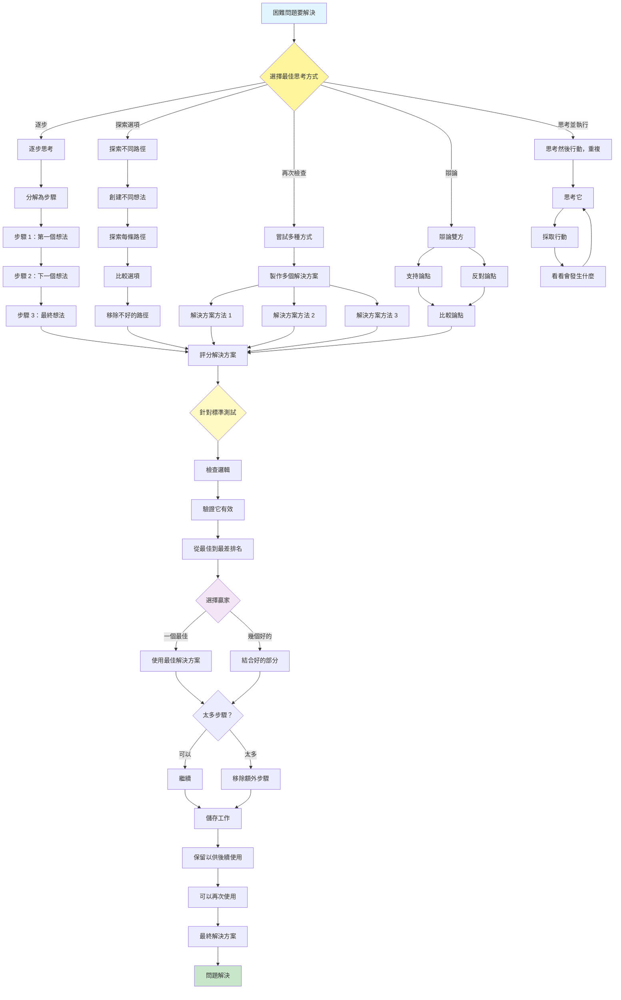

[English](../17-reasoning-techniques.md) | **繁體中文**

# 17. 推理技術模式 (Reasoning Techniques Pattern)

## 何時使用

- **複雜問題解決**：多步驟邏輯挑戰
- **數學推理**：需要系統性思考的問題
- **策略規劃**：評估多種方法
- **批判性分析**：深入檢視選項
- **決策制定**：系統性權衡替代方案
- **創意探索**：生成多樣化解決方案

## 視覺化流程

## 適用位置

- **研究分析**：分解複雜的研究問題
- **程式碼除錯**：系統性問題識別
- **業務策略**：評估策略選項
- **醫療診斷**：鑑別診斷推理
- **法律分析**：建構邏輯論證

## 優點

- **提高準確性**：系統性思考減少錯誤
- **透明度**：清晰的推理軌跡
- **探索**：考慮多條解決方案路徑
- **健壯性**：多種方法提供驗證
- **學習**：推理軌跡有助於改進
- **彈性**：不同問題使用不同技術
- **品質**：通過深思熟慮獲得更高品質的解決方案

## 缺點

- **延遲增加**：多個推理步驟需要時間
- **標記消耗**：詳細的推理使用更多標記
- **複雜性**：管理推理流程具有挑戰性
- **過度思考**：可能使簡單問題變得複雜
- **上下文限制**：長推理可能超過視窗
- **成本倍增**：多條路徑增加成本
- **收益遞減**：額外推理可能無助益

## 實際案例

1. **數學問題解決器**：
   - 思維鏈逐步解決方案
   - 自我一貫性檢查多種方法
   - 思維樹探索解決方案分支
   - 通過不同方法驗證
   - 清晰的解釋生成

2. **策略性業務顧問**：
   - 思維樹進行策略探索
   - 在成長與效率之間辯論
   - 跨市場分析的自我一貫性
   - 帶資料檢索的 ReAct 模式
   - 最佳策略的綜合

3. **程式碼架構設計師**：
   - 思維鏈用於設計決策
   - 架構的樹探索
   - 設計模式之間的辯論
   - 帶程式碼分析工具的 ReAct
   - 文件的推理持久化

4. **醫療診斷系統**：
   - 鑑別診斷推理樹
   - 跨症狀的自我一貫性
   - 治療計劃的思維鏈
   - 治療選項之間的辯論
   - 基於實證的推理軌跡

5. **法律案例分析器**：
   - 法律論證的思維鏈
   - 先例的樹探索
   - 解釋之間的辯論
   - 跨法規的自我一貫性
   - 結構化法律推理

6. **投資分析平台**：
   - 情境分析的思維樹
   - 跨估值的自我一貫性
   - 多頭與空頭案例的辯論
   - DCF 模型的鏈推理
   - 帶市場資料檢索的 ReAct

## 原始檔案

- **模式討論**：[pattern-discussion/reasoning-techniques.md](../../pattern-discussion/reasoning-techniques.md)
- **Mermaid 來源**：[mermaid-diagrams/reasoning-techniques.mmd](../../mermaid-diagrams/reasoning-techniques.mmd)
