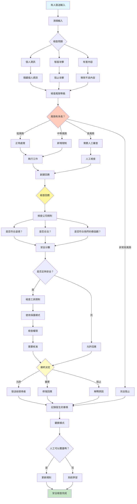

[English](../18-guardrails-safety-patterns.md) | **繁體中文**

# 18. 護欄/安全模式 (Guardrails/Safety Patterns)

## 何時使用

- **面向公眾的系統**：保護使用者免受有害內容影響
- **受管制行業**：確保遵守法律
- **品牌保護**：維護公司聲譽
- **資料隱私**：保護敏感資訊
- **安全需求**：防止系統被利用
- **道德 AI**：確保負責任的 AI 行為

## 視覺化流程

## 適用位置

- **聊天機器人和助理**：面向客戶的 AI 系統
- **內容生成**：自動化內容創作
- **醫療 AI**：醫療建議和診斷
- **金融服務**：交易和諮詢系統
- **教育平台**：面向學生的 AI 工具

## 優點

- **風險緩解**：防止有害輸出
- **合規性**：符合法規要求
- **品牌保護**：維護聲譽
- **使用者安全**：保護免受不當內容影響
- **安全性**：防止利用企圖
- **一致性**：統一的安全標準
- **可稽核性**：清晰的安全決策軌跡

## 缺點

- **誤報**：可能阻止合法請求
- **延遲增加**：安全檢查增加處理時間
- **使用者挫折**：過度限制性過濾
- **複雜性**：多層檢查
- **維護負擔**：政策需要定期更新
- **上下文盲點**：可能錯過細微的安全問題
- **成本開銷**：額外處理和監控

## 實際案例

1. **社群媒體 AI 審核員**：
   - 仇恨言論檢測和過濾
   - 使用者貼文中的 PII 編輯
   - 錯誤資訊標記
   - 暴力/圖形內容阻止
   - 版權違規檢測
   - 誤報的申訴流程

2. **醫療聊天機器人**：
   - 醫療建議免責聲明
   - 緊急情況檢測
   - 藥物交互作用警告
   - 健康資料的隱私保護
   - 範圍限制執行
   - 專業轉介觸發器

3. **財務諮詢 AI**：
   - 投資風險警告
   - 法規遵循檢查
   - 內線交易防範
   - 客戶適用性驗證
   - 市場操縱檢測
   - 稽核軌跡維護

4. **教育 AI 導師**：
   - 適齡內容過濾
   - 學術誠信保護
   - 霸凌/騷擾防範
   - 個人資訊保護
   - 不當主題阻止
   - 家長/教師覆蓋選項

5. **企業 AI 助理**：
   - 資料分類執行
   - 存取控制驗證
   - 機密性保護
   - 合規性檢查
   - 安全威脅檢測
   - 活動記錄和監控

6. **內容生成平台**：
   - 版權侵權防範
   - 商標保護
   - 誹謗阻止
   - 偏見檢測和緩解
   - 事實查核整合
   - 品質標準執行

## 原始檔案

- **模式討論**：[pattern-discussion/guardrails-safety-patterns.md](../../pattern-discussion/guardrails-safety-patterns.md)
- **Mermaid 來源**：[mermaid-diagrams/guardrails-safety-patterns.mmd](../../mermaid-diagrams/guardrails-safety-patterns.mmd)
