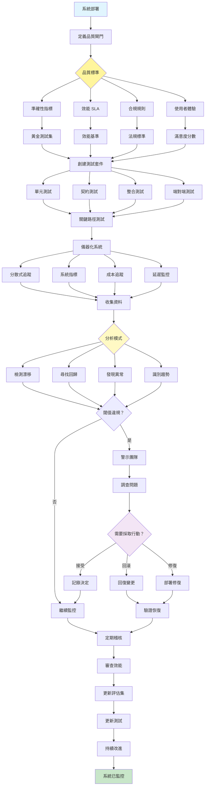

[English](../19-evaluation-and-monitoring.md) | **繁體中文**

# 19. 評估與監控模式 (Evaluation and Monitoring Pattern)

## 何時使用

- **生產系統**：任何需要可靠性的系統
- **品質保證**：確保一致的效能
- **合規需求**：符合法規標準
- **效能最佳化**：識別瓶頸
- **成本管理**：追蹤資源使用
- **持續改進**：資料驅動的最佳化

## 視覺化流程

## 適用位置

- **企業 AI 部署**：關鍵任務系統
- **SaaS 平台**：多租戶服務監控
- **醫療系統**：患者安全監控
- **金融服務**：交易系統監督
- **電子商務**：交易和推薦監控

## 優點

- **可靠性**：早期檢測問題
- **效能可見性**：清晰的系統洞察
- **品質保證**：一致的輸出標準
- **成本控制**：資源使用追蹤
- **合規性**：維護稽核軌跡
- **改進資料**：指標指導最佳化
- **使用者信任**：透明的效能指標

## 缺點

- **基礎設施開銷**：監控系統需要資源
- **複雜性**：管理多個指標和警報
- **警報疲勞**：太多通知
- **儲存成本**：記錄和指標資料
- **效能影響**：儀器化增加開銷
- **維護負擔**：保持測試更新
- **誤報**：不必要的警報和回滾

## 實際案例

1. **電子商務推薦引擎**：
   - 點擊率監控
   - 轉換追蹤
   - A/B 測試評估
   - 延遲監控
   - 每次推薦的成本
   - 使用者偏好的漂移檢測

2. **客戶服務聊天機器人**：
   - 解決率追蹤
   - 客戶滿意度分數
   - 回應時間監控
   - 升級率分析
   - 每次互動的成本
   - 品質抽樣和審查

3. **金融交易系統**：
   - 交易執行監控
   - 滑點追蹤
   - 風險限制合規
   - 延遲測量
   - 損益歸因
   - 法規稽核日誌

4. **內容審核平台**：
   - 準確性指標（精確度/召回率）
   - 誤報率
   - 每個項目的處理時間
   - 人工一致性分數
   - 每次審核的成本
   - 政策違規趨勢

5. **醫療診斷 AI**：
   - 診斷準確率
   - 假陰性監控
   - 診斷時間
   - 臨床醫生一致性分數
   - 系統可用性指標
   - 患者結果追蹤

6. **程式碼生成工具**：
   - 程式碼品質指標
   - 編譯成功率
   - 測試通過率
   - 開發者接受率
   - 生成時間追蹤
   - 使用模式分析

## 原始檔案

- **模式討論**：[pattern-discussion/evaluation-and-monitoring.md](../../pattern-discussion/evaluation-and-monitoring.md)
- **Mermaid 來源**：[mermaid-diagrams/evaluation-and-monitoring.mmd](../../mermaid-diagrams/evaluation-and-monitoring.mmd)
