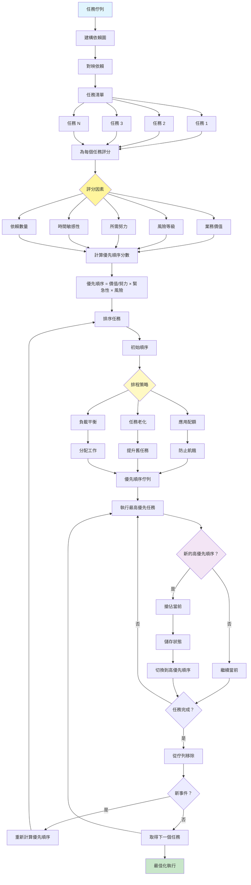

[English](../20-prioritization.md) | **繁體中文**

# 20. 優先順序模式 (Prioritization Pattern)

## 何時使用

- **資源約束**：有限的處理能力
- **多個目標**：競爭的目標和任務
- **動態環境**：不斷變化的優先順序
- **複雜依賴**：具有相互依賴的任務
- **時間敏感操作**：截止日期驅動的工作
- **公平排程**：防止任務飢餓

## 視覺化流程

## 適用位置

- **任務管理系統**：工作流程編排
- **客戶服務**：工單優先順序
- **製造**：生產排程
- **醫療**：患者分流系統
- **DevOps**：部署和維護優先順序

## 優點

- **效率**：資源的最佳使用
- **回應性**：優先處理高優先順序項目
- **公平性**：防止無限期延遲
- **適應性**：調整以適應變化條件
- **透明度**：清晰的優先順序邏輯
- **目標一致**：按業務價值排序任務
- **可擴展性**：處理增長的任務佇列

## 缺點

- **複雜性**：優先順序計算可能很複雜
- **開銷**：持續重新排序消耗資源
- **飢餓風險**：低優先順序任務可能永遠等待
- **上下文切換**：搶佔增加開銷
- **主觀評分**：優先順序因素可能有爭議
- **依賴**：複雜的依賴管理
- **預測錯誤**：努力估計可能錯誤

## 實際案例

1. **客戶支援系統**：
   - 高級客戶獲得優先權
   - 緊急問題排名較高
   - 基於年齡的升級
   - 基於技能的路由
   - SLA 合規追蹤
   - 代理之間的負載平衡

2. **軟體開發管線**：
   - 關鍵錯誤優先處理
   - 功能價值評分
   - 技術債務排程
   - 依賴解決
   - 衝刺容量規劃
   - 資源分配

3. **醫療分流**：
   - 緊急嚴重程度評分
   - 等待時間考慮
   - 資源可用性
   - 專家路由
   - 測試結果優先順序
   - 預約排程

4. **製造排程器**：
   - 訂單價值優先順序
   - 截止日期管理
   - 資源最佳化
   - 設定時間最小化
   - 品質需求
   - 維護視窗

5. **內容發佈**：
   - 熱門主題優先權
   - 編輯日曆
   - 作者可用性
   - SEO 價值評分
   - 社群媒體時機
   - 跨平台協調

6. **網路流量管理**：
   - QoS 封包優先順序
   - 頻寬分配
   - 延遲敏感路由
   - 公平排隊
   - 緊急流量優先權
   - 負載平衡

## 原始檔案

- **模式討論**：[pattern-discussion/prioritization.md](../../pattern-discussion/prioritization.md)
- **Mermaid 來源**：[mermaid-diagrams/prioritization.mmd](../../mermaid-diagrams/prioritization.mmd)
