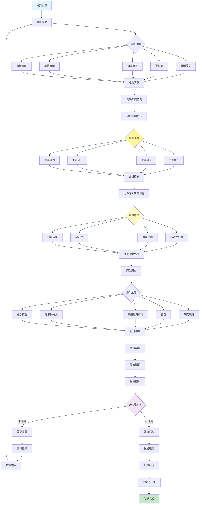

[English](../21-exploration-and-discovery.md) | **繁體中文**

# 21. 探索與發現模式 (Exploration and Discovery Pattern)

## 何時使用

- **研究專案**：調查新領域
- **創新計劃**：尋找突破性機會
- **問題空間**：理解複雜挑戰
- **知識差距**：識別未知之處
- **競爭分析**：發現市場機會
- **科學研究**：生成和測試假設

## 視覺化流程

## 適用位置

- **研發部門**：新產品開發
- **學術研究**：科學調查
- **市場研究**：機會識別
- **藥物發現**：製藥研究
- **技術偵察**：新興技術探索

## 優點

- **創新賦能**：發現新可能性
- **全面覆蓋**：廣泛探索空間
- **模式識別**：識別隱藏連接
- **假設生成**：創建可測試的理論
- **知識建構**：累積領域專業知識
- **意外發現**：實現意外發現
- **系統方法**：結構化探索流程

## 缺點

- **時間密集**：探索需要大量時間
- **資源密集**：需要大量計算/資料
- **不確定結果**：無保證的發現
- **範圍蔓延**：可能超出邊界
- **資訊過載**：管理大量資料
- **方向挑戰**：決定關注焦點
- **ROI 不確定**：價值可能不立即顯現

## 實際案例

1. **藥物發現平台**：
   - 藥物標靶的文獻挖掘
   - 化學空間探索
   - 副作用模式分析
   - 臨床試驗資料挖掘
   - 化合物的假設生成
   - 實驗設計最佳化

2. **市場機會尋找器**：
   - 消費者趨勢分析
   - 競爭對手格局對映
   - 技術融合識別
   - 未滿足需求發現
   - 商業模式創新
   - 合作夥伴機會偵察

3. **科學研究助理**：
   - 文獻回顧自動化
   - 跨學科連接尋找
   - 實驗設計建議
   - 資料模式發現
   - 假設生成
   - 協作網路建構

4. **技術創新偵察**：
   - 專利格局分析
   - 新興技術追蹤
   - 研究實驗室監控
   - 新創生態系統對映
   - 技術可行性評估
   - 創新機會排名

5. **情報分析系統**：
   - 開源情報收集
   - 跨來源模式識別
   - 威脅格局對映
   - 異常檢測
   - 預測建模
   - 策略評估生成

6. **教育研究平台**：
   - 學習方法探索
   - 課程差距分析
   - 學生表現模式
   - 教學創新發現
   - 最佳實踐識別
   - 介入策略開發

## 原始檔案

- **模式討論**：[pattern-discussion/exploration-and-discovery.md](../../pattern-discussion/exploration-and-discovery.md)
- **Mermaid 來源**：[mermaid-diagrams/exploration-and-discovery.mmd](../../mermaid-diagrams/exploration-and-discovery.mmd)
